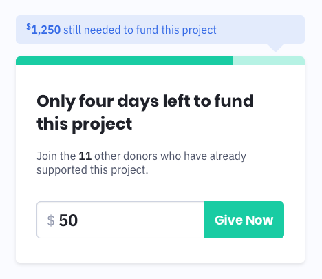

# 🚀 Zach Reed - AC - HW

## About // Links

-   [Zach Reed](http://iamzachreed.com)
-   [GitHub Pages Demo](https://bluetidepro.github.io/ac-hw/)
-   Project was bootstrapped with [Create React App](https://github.com/facebookincubator/create-react-app).

## HW Directions Given

Please develop the above design sharing the code how you wish—CodePen, GitHub, Bitbucket or the alike. In doing so, please follow the following guidelines:

-   The total goal for donations is $5,000
-   Any given donation cannot be below $5
-   Upon receiving a donation, the total still needed, progress bar, and number of
    donors should all be updated

#### Notes:

-   The P​oppins​ and IBM Plex Sans​ typefaces may be found on Google Fonts

#### Bonus Points:

-   Use Saas as a preprocess for your CSS
-   Add active, hover, success, and error states according
